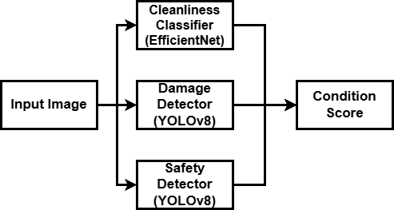
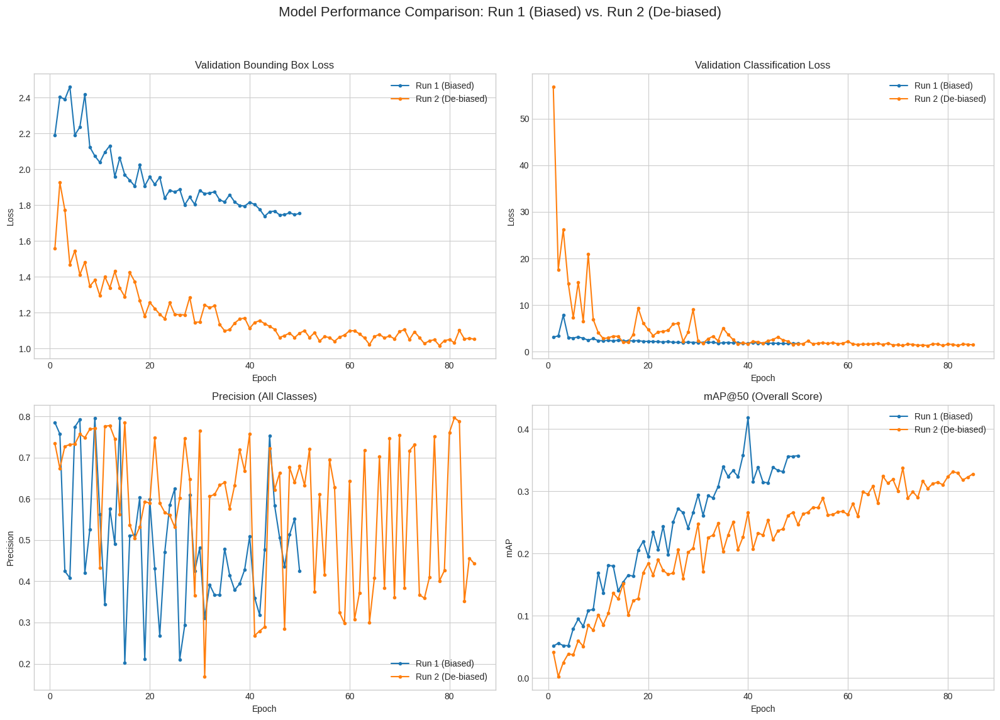
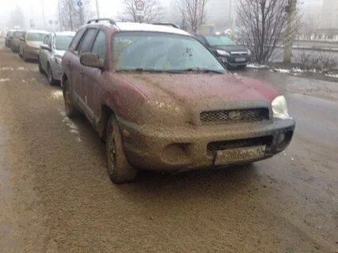
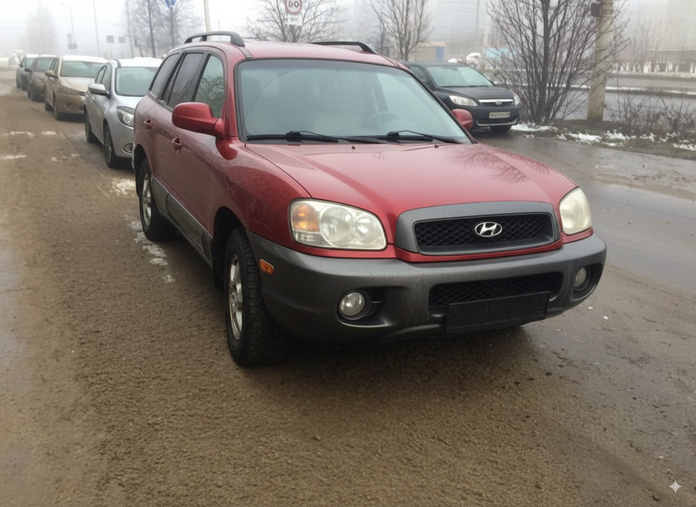
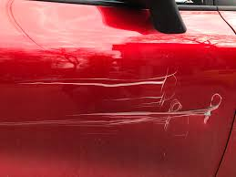
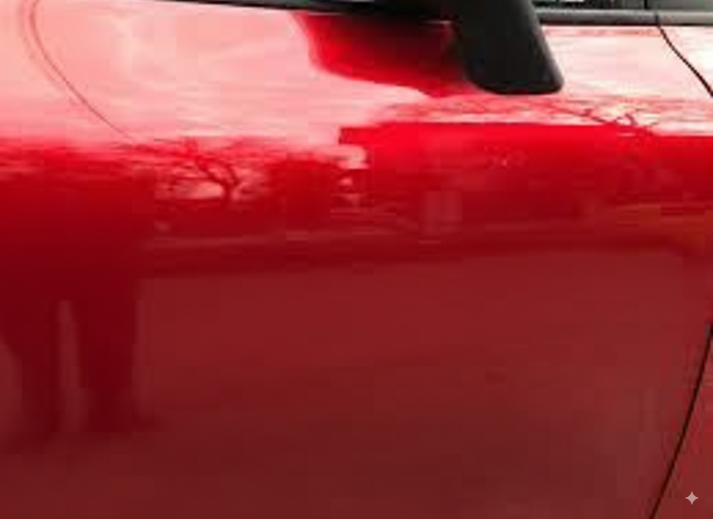
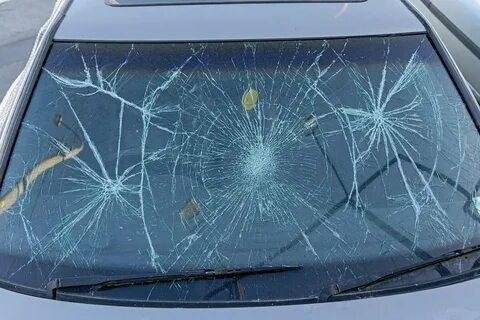
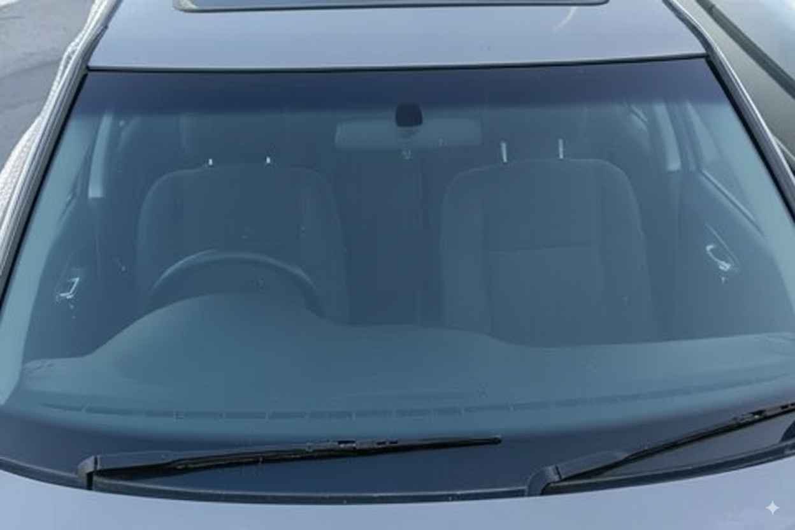

# InVision AI: Automated Vehicle Condition Analysis

A computer vision platform for automated vehicle condition analysis from a single photograph, submitted for the Decentrathon by Dosbol Erlan.

---

### Demo

*   **Live Application:** [**https://dudosya-indrive-vision.streamlit.app/**](https://dudosya-indrive-vision.streamlit.app/)

The platform's analysis is demonstrated in the videos below.

| Use Case | Demonstration (Click to Play) |
| :--- | :---: |
| ✅ **Clean Vehicle (Pass)** | [](https://www.youtube.com/watch?v=bdF5OKvWusc) |
| ⚠️ **Dirty Vehicle (Review)** | [](https://www.youtube.com/watch?v=bdF5OKvWusc) |
| ❌ **Unsafe Vehicle (Fail)** | [](https://www.youtube.com/watch?v=AExnKothz4k) |

---

## 1. Business Application

The platform automates the manual review process for vehicle condition.

*   **Driver Onboarding:** Provides a pass/fail/review verdict on new vehicle submissions to accelerate driver activation.
*   **Complaint Validation:** Objectively validates rider-submitted photos of vehicle condition (e.g., dirt, damage).
*   **Fleet Safety Audits:** Enables automated, periodic checks for safety issues like cracked windshields or tire damage.

---

## 2. Technical Overview

The system uses a pipeline of three custom-trained models for analysis.



### Core Components:
*   **Multi-Model Analysis:**
    1.  **Safety Model (YOLOv8n):** Detects `cracked_windshields`, `headlight_oxidation`, `tire_damage`.
    2.  **Damage Model (YOLOv8n):** Identifies `scratches`, `dents`, `rust`.
    3.  **Cleanliness Model (EfficientNet-B0):** Classifies the vehicle as `clean` or `dirty`.
*   **Condition Score:** Aggregates model outputs into a single 0-100 score.
*   **Severity Assessment:** Classifies cosmetic damage severity (Minor, Moderate, Severe) based on the detection's relative size.
*   **User Interface:** A Streamlit application for report visualization.

---

## 3. Bias Correction Case Study

A primary technical challenge was diagnosing and fixing dataset bias.

The initial damage model (`Run 1`) exhibited **"framing bias,"** producing false positives on clean close-ups. It incorrectly correlated close-up photos with the presence of damage.

This was addressed by augmenting the dataset with **1,924 negative examples** (clean close-ups) and re-training the model (`Run 2`). While `Run 2`'s mAP is lower on the original *biased validation set*, its real-world performance is superior due to the elimination of this specific bias. The final application uses the de-biased model.



This **Train -> Diagnose -> Augment -> Re-train** cycle was a core part of the development process.

---

## 4. Future Work Highlight: Curing Bias with Synthetic Data

A proposed method to further mitigate dataset bias is the use of paired synthetic data generated by image-to-image models. This allows for the creation of large, perfectly balanced datasets. A proof-of-concept is demonstrated below.

| Domain | Before (Original Image) | After (AI-Generated Version) |
| :---: | :---: | :---: |
| **Cleanliness** |  |  |
| **Cosmetic Damage** |  |  |
| **Safety** |  |  |

---

## 5. How to Run Locally

1.  **Clone the repository:**
    ```bash
    git clone https://github.com/dudosya/indrive-vision-ai.git
    cd indrive-vision-ai
    ```
2.  **Create and activate a Python virtual environment:**
    ```bash
    python3 -m venv venv
    source venv/bin/activate
    # On Windows: venv\Scripts\activate
    ```
3.  **Install dependencies:**
    ```bash
    pip install -r requirements.txt
    ```
4.  **Run the Streamlit application:**
    ```bash
    streamlit run app.py
    ```

---

## 6. Tech Stack

*   **Application:** Streamlit
*   **ML/DL Frameworks:** PyTorch, Ultralytics (YOLOv8), `timm`
*   **Image Processing:** Pillow, OpenCV
*   **Data Management:** Roboflow
*   **Training:** Google Colab (T4 GPU)
*   **Deployment:** Streamlit Community Cloud