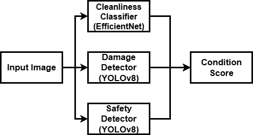

# 🚗 InVision AI: Automated Vehicle Quality & Safety Platform

**Submission for the InDrive Hackathon by Team MRZL (Dosbol Erlan)**

This project is a comprehensive computer vision platform designed to automate vehicle condition analysis from a single photograph, built to address the core challenges of quality control and safety in the ride-hailing industry.

---

### 🚀 Live Demo & Demo Videos

*   **Experience the live application:** [**https://dudosya-indrive-vision.streamlit.app/**](https://dudosya-indrive-vision.streamlit.app/)

Our platform's capabilities are demonstrated in the following three short videos, each highlighting a key real-world use case for InDrive.

| Use Case | Demo Video (Click to Play) | Key Feature Demonstrated |
| :--- | :---: | :--- |
| ✅ **The "Good" Case** <br> (Automated Onboarding Pass) | [](clean.mp4) | The system correctly identifies a clean, safe vehicle, assigning a high Condition Score suitable for an automatic pass. |
| ⚠️ **The "Average" Case** <br> (Customer Complaint / Needs Review) | [](dirty.mp4) | The system detects cosmetic issues (dirt & damage), validates a potential customer complaint, and generates a lower score flagging the vehicle for review. |
| ❌ **The "Unsafe" Case** <br> (Proactive Safety Fail) | [](cracked_windshield.mp4) | The system identifies a critical safety hazard, triggers a prominent alert, and assigns a failing score, demonstrating its role in risk mitigation. |

---

## 1. Business Value Proposition for InDrive

InVision AI directly addresses key operational bottlenecks by transforming a slow, subjective manual review process into a fast, objective, and scalable automated system.

### Key Applications:
*   **Driver Onboarding Automation:** Instantly provides a pass/fail/review verdict on new vehicle submissions, reducing manual labor and accelerating driver activation.
*   **Customer Complaint Triage:** Objectively validates rider-submitted photos of vehicle condition (e.g., "car was dirty"), enabling faster, fairer support resolutions.
*   **Proactive Fleet Safety Audits:** Perform automated, periodic spot-checks to identify and flag safety issues like cracked windshields before they become a liability.

---

## 2. Technical Architecture & Features

The platform uses a parallel pipeline of three specialized, custom-trained AI models to perform a comprehensive analysis.



### Core Features:
*   **Multi-Model Analysis:** Utilizes three distinct models for a granular report:
    1.  **🛡️ Safety Model (YOLOv8n):** Detects critical hazards like `cracked_windshields`, `headlight_oxidation`, and `tire_damage`.
    2.  **🔧 Damage Model (YOLOv8n):** Identifies cosmetic issues like `scratches`, `dents`, and `rust`.
    3.  **🧼 Cleanliness Model (EfficientNet-B0):** Classifies the vehicle's overall `clean` or `dirty` state.
*   **Vehicle Condition Score:** Aggregates all model outputs into a single, intuitive score from 0-100 for at-a-glance assessment.
*   **Severity Assessment:** Automatically classifies the severity of cosmetic damages (Minor, Moderate, Severe) based on their relative size.
*   **Fast & Interactive UI:** Built with Streamlit, the platform provides a responsive and user-friendly interface with detailed, tab-based reporting.

---

## 3. A Data-Centric Journey: A Case Study in Curing AI Bias

Our most significant technical achievement was not just training models, but diagnosing and fixing critical dataset biases—a crucial step for building real-world AI.

Our baseline damage model (`Run 1`) achieved a high mAP (0.42) but suffered from **"framing bias,"** producing false positives on clean close-ups. It had learned the false correlation: `"close-up photo" = "damage"`.

We solved this by programmatically generating **1,924 negative examples** (clean close-ups) and re-training the model (`Run 2`). The comparison below shows that while `Run 2`'s mAP score is lower on the original *biased validation set*, its real-world performance is vastly superior because it no longer makes these simple mistakes. **Our final application uses this robust, de-biased model.**


This iterative **Train -> Diagnose -> Fix Data -> Re-train** cycle was central to our methodology and demonstrates a mature approach to applied machine learning.

---

## Future Work Highlight: Curing Bias with Synthetic Data

Our analysis proved that dataset bias is the greatest challenge to building a production-ready model. The most promising solution is to create **perfectly paired synthetic datasets** using image-to-image AI models. We conducted a successful proof-of-concept demonstrating this advanced technique:

| Domain | Before (Original Image) | After (AI-Generated Version) |
| :---: | :---: | :---: |
| **Cleanliness** |  |  |
| **Cosmetic Damage** |  |  |
| **Safety** |  |  |

This method allows for the creation of massive, perfectly balanced datasets, representing a clear path to a hyper-realistic and unbiased AI model.

---

---

## 4. How to Run Locally

1.  **Clone the repository:**
    ```bash
    git clone https://github.com/dudosya/indrive-vision-ai.git
    cd indrive-vision-ai
    ```
2.  **Create and activate a Python virtual environment:**
    ```bash
    python3 -m venv venv
    source venv/bin/activate
    # On Windows: venv\Scripts\activate
    ```
3.  **Install dependencies:**
    The application requires system-level libraries for OpenCV, which are handled by `packages.txt` in the Streamlit Cloud deployment. For local use, ensure you have a working OpenCV installation.
    ```bash
    pip install -r requirements.txt
    ```
4.  **Run the Streamlit application:**
    ```bash
    streamlit run app.py
    ```

---

## 5. Tech Stack

*   **Application:** Streamlit
*   **ML/DL Frameworks:** PyTorch, Ultralytics (YOLOv8), `timm`
*   **Data & Image Processing:** Pandas, Pillow, OpenCV
*   **Data Management & Labeling:** Roboflow
*   **Training Environment:** Google Colab (T4 GPU)
*   **Deployment:** Streamlit Community Cloud